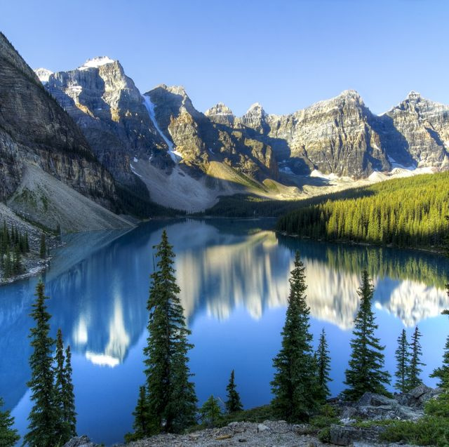
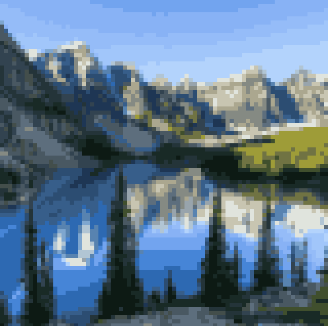
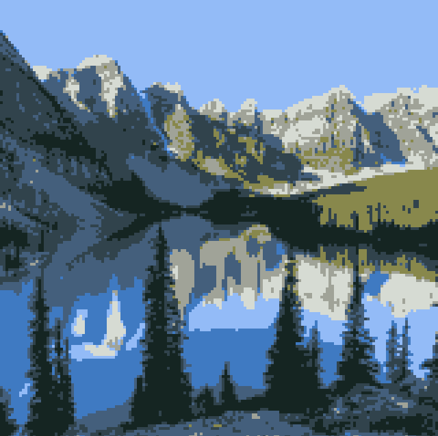
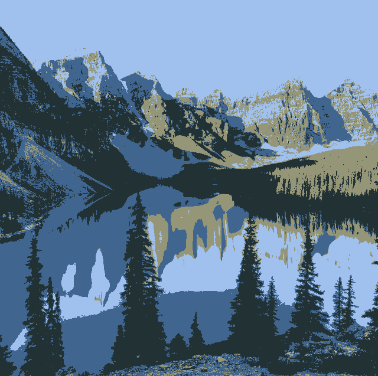
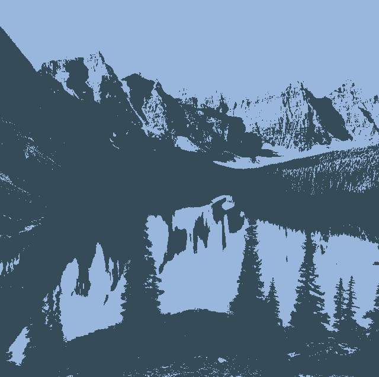

# Pixelate

This script pixelates an image using a colour palette of a given size.

# Installation
To run the script, first install its dependencies:

`pip3 install opencv-python numpy`

# Usage
The pixelate script syntax is as follows:
`python3 pixelate.py input_path output_path`

For optional usage and additional parameters, use:
`python3 pixelate.py --help`

# Examples
The `examples` folder shows a couple of example pictures pre and post pixelization.
Here are some examples:

Pixelated with `b = 8` and `c = 64`.

Pixelated with `b = 4` and `c = 8`.

With `b = 1`, the script essentially reduces the image to a smaller color palette, creating some cool effects.

With `c = 4`.

With `c = 2`.

